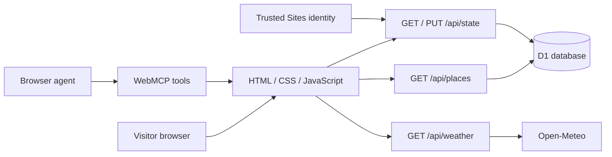

# How the app works

## Catalog

`lib/places.json` provides the initial six places. `/api/places` inserts missing catalog records with prepared statements, then reads them from D1. It does not overwrite existing database records. Editing the seed file changes new records; changing an existing hosted record requires a controlled data update. Schema migrations contain no place dataset.

## Saved trips

`trip_plans.user_id` is the primary key. The backend reads the authenticated user ID from the trusted hosting boundary and uses it in every read and update. The client cannot supply another visitor's user ID in its trip payload.

Each visitor has one current plan containing favorites, ordered stop IDs, title, optional date, and notes. A revision number prevents stale tabs from silently overwriting newer edits. The frontend preserves unsaved changes after a failed save and offers a reload action for conflicts.

## Authentication

Sites supplies authenticated identity headers in production. Local development uses the starter's loopback-only mock sign-in. The mock strips incoming identity headers and adds its test identity only after local sign-in.

`npm start` previews a built Worker; it does not provide real production authentication. If deploying outside Sites, replace the header-based identity adapter with a verified session system. Never trust identity headers supplied directly by an Internet client.

## Weather and maps

The backend calls Open-Meteo with a timeout and validates the returned temperature and date list. A ten-minute in-memory cache reduces requests within a running Worker isolate; it is not a shared global cache. Errors return a recoverable unavailable state.

Maps are OpenStreetMap embeds with coordinates from the catalog. The app does not calculate route duration, make reservations, or process payments.

## Agent tools

The browser registers tools only when `document.modelContext` is supported:

| Tool | Effect |
| --- | --- |
| `filter_tbilisi_places` | Changes the visible category |
| `open_tbilisi_place` | Opens a place and map |
| `suggest_tbilisi_day` | Replaces draft stops with a guided suggestion; does not save |
| `save_tbilisi_trip` | Saves the current draft for the signed-in visitor |

These are browser WebMCP tools, not a hosted remote MCP server. The planner is deterministic and has no LLM API dependency.

## Practical limits

- One saved itinerary per user.
- Six seeded places; no admin editor or file-upload flow.
- No public email/password accounts.
- No real-time routing or booking.
- Private hosted access is configured separately from this public repository.
